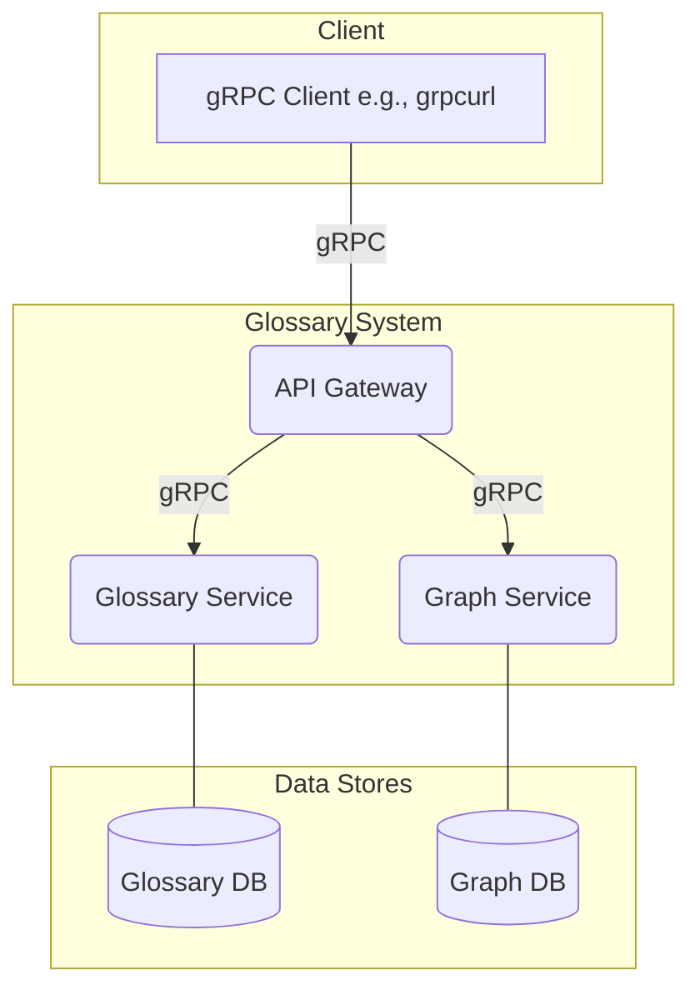

# Python Glossary Microservices

A high-performance, gRPC-based microservice system for creating and managing a glossary of interconnected terms. This project provides a scalable backend for building a rich, queryable knowledge graph.

## Table of Contents

- [Overview](#overview)
- [Features](#features)
- [Technology Stack](#technology-stack)
- [Architecture](#architecture)
  - [1. Glossary Service](#1-glossary-service)
  - [2. Graph Service](#2-graph-service)
  - [3. API Gateway](#3-api-gateway)
- [Getting Started](#getting-started)
  - [Prerequisites](#prerequisites)
  - [Local Development Setup](#local-development-setup)
- [Usage](#usage)
  - [Interacting with the API](#interacting-with-the-api)
  - [Example Requests](#example-requests)
- [Deployment](#deployment)
  - [Deploy to Render](#deploy-to-render)
- [Configuration](#configuration)
- [Contributing](#contributing)
- [License](#license)

## Overview

This project provides the backend infrastructure for a glossary application. It moves beyond simple key-value definitions by allowing users to establish typed relationships between terms, effectively creating a knowledge graph. For example, a term like "Docker" can be linked to "Container" with an `IS_A` relationship, and to "Microservice" with a `RELATED_TO` relationship.

The system is built using a microservice architecture, with services communicating via gRPC for high-performance, low-latency operations. This design ensures scalability, maintainability, and a clear separation of concerns.

## Features

*   **Full Term Management:** Complete CRUD (Create, Read, Update, Delete) functionality for glossary terms.
*   **Knowledge Graph:** Define typed relationships (e.g., `RELATED_TO`, `IS_A`, `DEPENDS_ON`) between terms.
*   **Advanced Queries:** Fetch a term along with all its direct relationships or search terms by name and definition.
*   **Mind Map Generation:** Generate a node-and-edge representation of a term's local network, perfect for visualization in frontend applications.
*   **High-Performance API:** Uses a gRPC-first approach for efficient and strongly-typed communication between services.
*   **Scalable by Design:** Each component is a separate microservice that can be developed, deployed, and scaled independently.
*   **Containerized:** Fully containerized with Docker for consistent development and production environments.
*   **Cloud-Ready:** Includes an infrastructure-as-code configuration for one-click deployment to Render.

## Technology Stack

*   **Backend:** Python 3
*   **API & Communication:** gRPC, Protobuf
*   **Containerization:** Docker, Docker Compose
*   **Deployment:** Render (`render.yaml`)
*   **Linting:** Flake8

## Architecture

The system is composed of three distinct services. The API Gateway is the single public-facing entry point, which orchestrates calls to the two backend services.



### 1. Glossary Service

*   **Purpose:** The single source of truth for glossary terms. It manages the entire lifecycle of a term.
*   **Responsibilities:**
    *   Storing and retrieving term data (ID, name, definition).
    *   Providing full-text search functionality over all terms.

### 2. Graph Service

*   **Purpose:** Manages the relationships between terms. It treats the glossary as a graph, where terms are nodes and relationships are typed edges.
*   **Responsibilities:**
    *   Creating and deleting relationships between terms using their unique IDs.
    *   Querying for all relationships connected to a specific term.

### 3. API Gateway

*   **Purpose:** The single entry point for all external clients. It exposes a unified API and simplifies the client experience by hiding the internal service complexity.
*   **Responsibilities:**
    *   **Orchestration & Aggregation:** Combines data from multiple services. For example, the `GetTerm` endpoint fetches the core term from the `Glossary Service` and enriches it with relationship data from the `Graph Service`.
    *   **Implementing Business Logic:** Handles complex queries like `GetMindMapForTerm`, which requires multiple backend calls to build the final response.

## Getting Started

### Prerequisites

Ensure you have the following tools installed on your local machine:

*   [Docker](https://www.docker.com/products/docker-desktop/) & [Docker Compose](https://docs.docker.com/compose/install/)
*   [grpcurl](https://github.com/fullstorydev/grpcurl): A command-line tool for interacting with gRPC servers.
*   `git` for cloning the repository.

### Local Development Setup

1.  **Clone the Repository:**
    ```bash
    git clone https://github.com/your-username/glossary-project.git
    cd glossary-project
    ```

2.  **Generate gRPC Stubs:**
    The project's gRPC client and server code is generated from the `.proto` definitions. Run the provided script to generate these files.
    ```bash
    # Make the script executable (only necessary once)
    chmod +x ./scripts/generate_proto.sh

    # Run the script
    ./scripts/generate_proto.sh
    ```

3.  **Launch the Services:**
    Use Docker Compose to build and run the entire application stack.
    ```bash
    docker-compose up --build
    ```
    This command will start all services. The API Gateway will be available for requests at `localhost:50050`.

4.  **Shut Down:**
    To stop and remove the containers, press `Ctrl+C` and then run: `docker-compose down`.

## Usage

### Interacting with the API

The API Gateway exposes a gRPC API on port `50050`. The server does **not** have gRPC reflection enabled, so you must provide the path to the `.proto` files when using tools like `grpcurl`.

All `grpcurl` commands should be run from the root of the project directory.

### Example Requests

#### 1. Add a New Term

```bash
grpcurl -plaintext \
    -import-path ./proto \
    -proto ./proto/gateway.proto \
    -d '{
          "name": "gRPC",
          "definition": "A high performance, open source universal RPC framework."
        }' \
    localhost:50050 gateway.GatewayService.AddTerm
```

#### 2. Get a Term by Name (with its relationships)

```bash
grpcurl -plaintext \
    -import-path ./proto \
    -proto ./proto/gateway.proto \
    -d '{"name": "gRPC"}' \
    localhost:50050 gateway.GatewayService.GetTermByName
```

#### 3. Add a Relationship

First, you need the IDs of two existing terms. Then, you can link them. Let's assume you have the IDs for "gRPC" and "Protobuf".

```bash
grpcurl -plaintext \
    -import-path ./proto \
    -proto ./proto/gateway.proto \
    -d '{
          "from_term_id": "id-of-grpc",
          "to_term_id": "id-of-protobuf",
          "type": "DEPENDS_ON"
        }' \
    localhost:50050 gateway.GatewayService.AddRelationship
```

#### 4. Get a Term's Mind Map

This powerful endpoint retrieves a term and all its connected neighbors, providing a structure that can be easily rendered as a mind map or graph.

```bash
grpcurl -plaintext \
    -import-path ./proto \
    -proto ./proto/gateway.proto \
    -d '{"term_id": "id-of-grpc"}' \
    localhost:50050 gateway.GatewayService.GetMindMapForTerm
```

## Deployment

### Deploy to Render

This project is configured for seamless deployment on [Render](https://render.com/) using the `render.yaml` file for infrastructure as code.

Click the button below to deploy your own instance of the glossary system to Render:

[](https://render.com/deploy?repo=https://github.com/your-username/glossary-project)

Render will automatically detect the blueprint, provision the services, and wire them up to communicate with each other.

## Configuration

The services are configured using environment variables. Default values for local development are set in `docker-compose.yml`.

| Variable                | Service          | Description                                         | Default (Local)          |
| ----------------------- | ---------------- | --------------------------------------------------- | ------------------------ |
| `PORT`                  | All              | The port on which the gRPC server will listen.      | `50050`, `50051`, `50052` |
| `DATABASE_PATH`         | `glossary`, `graph` | The file path for the SQLite database.              | `/app/data/*.db`         |
| `GLOSSARY_SERVICE_ADDR` | `api-gateway`    | The address of the `glossary-service`.              | `glossary-service:50051` |
| `GRAPH_SERVICE_ADDR`    | `api-gateway`    | The address of the `graph-service`.                 | `graph-service:50052`    |

## Contributing

Contributions are welcome! If you'd like to improve the project, please follow these steps:

1.  Fork the repository.
2.  Create your feature branch (`git checkout -b feature/NewFeature`).
3.  Commit your changes (`git commit -m 'Add some NewFeature'`).
4.  Push to the branch (`git push origin feature/NewFeature`).
5.  Open a Pull Request.